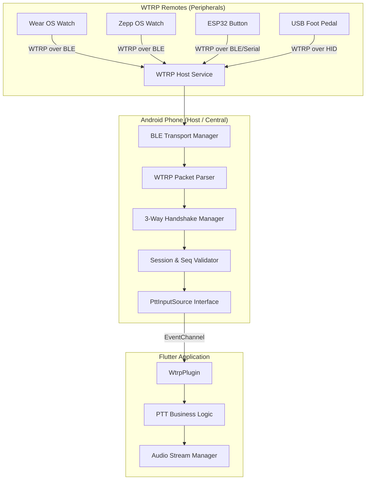
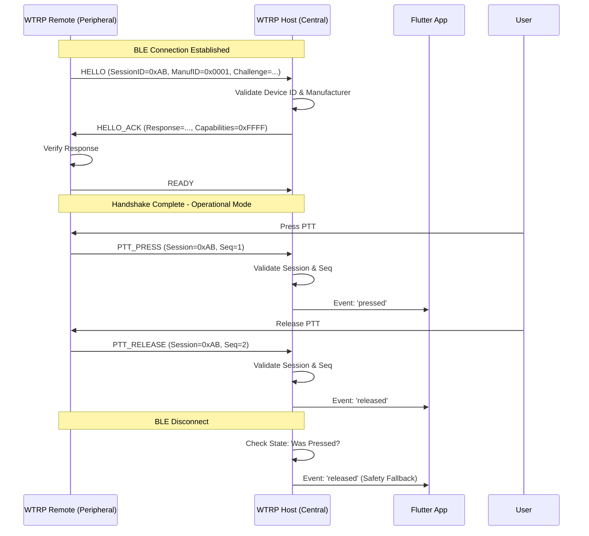

# WTRP Architecture

## System Diagram: Multiple Device Support

## Sequence Diagram: Finalized Handshake & PTT

## Latency Breakdown
- **Peripheral Sensing**: ~2ms
- **BLE Transmission**: ~7.5ms - 15ms (Negotiated Interval)
- **Host Parsing**: ~1ms
- **Flutter UI update**: ~2ms
- **Total**: ~12.5ms - 20ms
